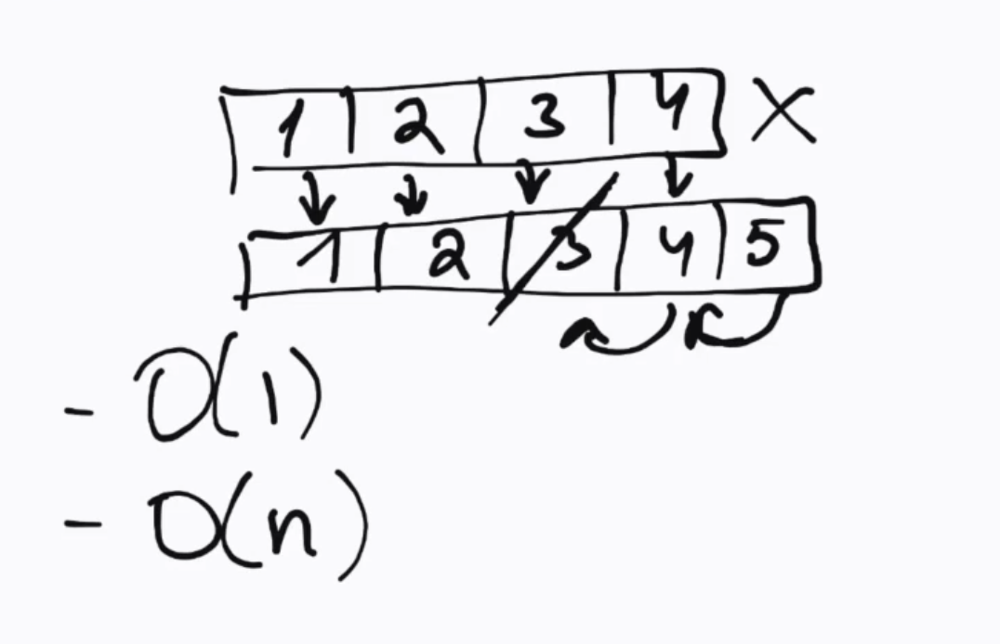

# Array'lar (Massivlar) haqida ma'lumot

Array — bu bir nechta qiymatlarni bitta o'zgaruvchida saqlash imkonini beruvchi ma'lumotlar tuzilmasi. Array'lar yordamida bir xil turdagi yoki turli turdagi ma'lumotlarni tartiblangan shaklda saqlash mumkin.

## Array yaratish uchun qoidalar
1) Continues - Array'lar continues (davomiy) xotira blokida joylashgan bo'lishi kerak. (o'rtada bush joy bo'lmasligi kerak, bo'lsa biz uni surishimiz (shift) kerak bo'ladi)
2) Chegaralangan - O'lchami chegaralangan bo'lishi kerak. (masalan: 10 ta element saqlash uchun 10 ta joy ajratiladi). Sig'may qolsa, yangi joy ajratish va eski ma'lumotlarni ko'chirish kerak bo'ladi.
3) Bir xil o'lchamda bo'lishi kerak. (xar bir element bir xil o'lchamda bo'lishi kerak)

## Array indekslari
1) Array elementlari doim 0 dan boshlanadi. Nega?
    - Formula: Boshlanish address + (index * element size)
    - Misol: Boshlanish address = 1000, element size = 4 byte
        - 0 index address = 1000 + (0 * 4) = 1000
        - 1 index address = 1000 + (1 * 4) = 1004
        - 2 index address = 1000 + (2 * 4) = 1008
        - 3 index address = 1000 + (3 * 4) = 1012
        - 4 index address = 1000 + (4 * 4) = 1016
    - Nega 1 dan boshlanmaydi?
        - 1 index address = 1000 + (1 * 4) = 1004
        - 2 index address = 1000 + (2 * 4) = 1008
        - 3 index address = 1000 + (3 * 4) = 1012
        - 4 index address = 1000 + (4 * 4) = 1016
        - 5 index address = 1000 + (5 * 4) = 1020
    - Ko'rinib turibdiki, 0 index address hisoblashda qulaylik tug'diradi. shu uchun ham arraylar bir xil o'lchamdagi elementlardan tashkil topgan va 0 dan boshlanadi.

2) Agar xotirada array uchun ajratilgan joy yetarli bo'lmasa, yangi joy ajratiladi va eski ma'lumotlar yangi joyga ko'chiriladi. Bu jarayon sekin ishlaydi, shuning uchun array'larni yaratishda ehtiyot bo'lish kerak. Element yozish uchun O(1) vaqt talab qilinsa, yangi joy ajratish va ko'chirish O(n) vaqt talab qiladi.

## Array amallari

- Qo'shish (insert): Array oxiriga yangi element qo'shish O(1) vaqt talab qiladi, lekin agar joy yetarli bo'lmasa, yangi joy ajratish va ko'chirish O(n) vaqt talab qiladi.
- O'chirish (delete): Array oxiridan element o'chirish O(1) vaqt talab qiladi, lekin o'rtadan yoki boshidan o'chirish O(n) vaqt talab qiladi, chunki qolgan elementlarni surish kerak bo'ladi.
- Qidirish (search): Array ichida element qidirish O(n) vaqt talab qiladi, chunki har bir element tekshirilishi kerak.
- Yangilash (update): Array ichidagi elementni yangilash O(1) vaqt talab qiladi, agar indeks ma'lum bo'lsa.