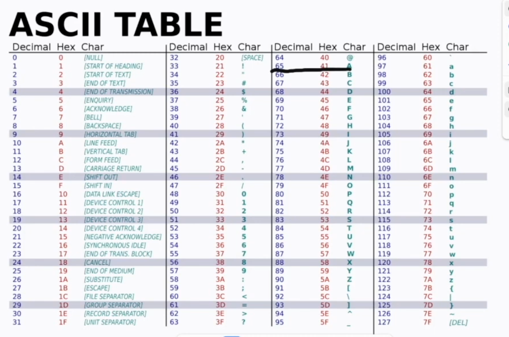

# String'lar haqida

String'lar - bu matnli ma'lumotlarni saqlash uchun ishlatiladigan ma'lumot turlari. Python dasturlash tilida string'lar qator belgilarni o'z ichiga oladi va ularni yaratish uchun qo'shtirnoq yoki qo'sh tirnoq ishlatiladi.
Masalan:

```python
# Oddiy string
my_string = "Salom, dunyo!"
# Yana bir string
another_string = 'Python dasturlash tili'
```

## Muhum qoidalar
1. String'lar immutable(o'zgarmas), ya'ni ularni yaratgandan so'ng o'zgartirib bo'lmaydi. Agar siz string'ni o'zgartirmoqchi bo'lsangiz, yangi string yaratishingiz kerak. Lekin iteratsiya va slicing kabi amallarni orqali string'lar ustida ishlash mumkin.
2. Tagida array yotadi, arraylarda biz faqat 2 lik sanoq tizimida yoza olamiz, qanday qilib u yerda hatlar yozishimiz mumkin? 
    - Jadvlar kerak buladi, masalan:
        * ASCII jadvali: (American Standard Code for Information Interchange) bu 128 ta belgini o'z ichiga oladi.
        * Unicode jadvali: (Universal Character Set) masalan emoji belgilarni o'z ichiga oladi. Unicode UTF-8, UTF-16 kabi kodlash turlarini qo'llab-quvvatlaydi.
        * UTF-8,16,32 kabi kodlash turlari mavjud. UTF-8 - bu Unicode belgilar to'plamini kodlash uchun ishlatiladigan eng keng tarqalgan usuldir. UTF-16 va UTF-32 esa Unicode belgilarini kodlash uchun ishlatiladi, lekin ular kamroq qo'llaniladi.
3. Masalan string variable o'zgartirish uchun: 
- Space O(n)
- Time O(n)
```python
my_string = "Salom, dunyo!"
#loop orqali stringni o'zgartirish
new_string = ""
for char in my_string:
    if char == " ":
        new_string += "_"
    else:
        new_string += char
print(new_string)  # Natija: "Salom,_dunyo!"

# C, C++ da stringlar o'zgartirish mumkin. Constant vaqt O(1) bo'ladi.
# Pythonda esa masalan "davron" degan text yaratsak dasturlar tilini uni xotirada qayta qayta yaratmaydi, balki bitta joyda saqlaydi va har safar shu joyga murojaat qiladi. (optimallashgan)
```

* C dasturlash tilida string'lar shunchaki array, char degan tashkil topgan belgilar ketma-ketligidir. String'lar null-terminatsiyalangan bo'lib, ya'ni oxirida maxsus '\0' belgisi mavjud.

## Xulosa
* String'lar dasturlashda matnli ma'lumotlarni saqlash va manipulyatsiya qilish uchun muhim vositadir. Ularning immutable xususiyati va kodlash turlari dasturchilar uchun muhim tushunchalardir.
