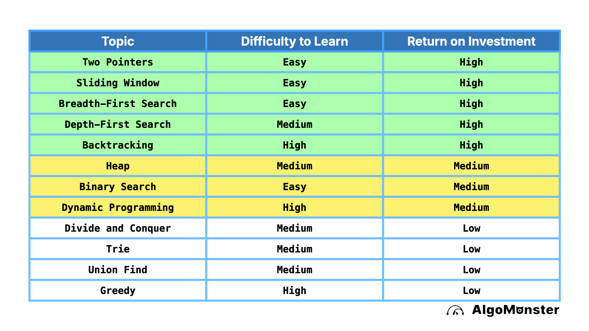

# Video Lessons on Data Structures and Algorithms

Video lessons about the basics of data structures, algorithms, and more. These lessons are designed to help beginners understand fundamental concepts in computer science and programming.

## Table of Contents
1. [Data Structures](./data-structures.md)
2. [Algorithms](./algorithms.md)
3. [Programming Concepts](./programming-concepts.md)
4. [Problem Solving](./problem-solving.md)
5. [LeetCode Tips](./leetcode-tips.md)

- ROI table based on the above analysis

## Conclusion
Investing in video lessons on data structures and algorithms can provide a significant return on investment (ROI) for individuals looking to enhance their programming skills and career prospects. By understanding the basics of data structures and algorithms, learners can improve their problem-solving abilities, perform better in coding interviews, and increase their chances of landing a job in the tech industry. The ROI can be measured in terms of increased job opportunities, higher salaries, and improved coding skills, making it a worthwhile investment for aspiring programmers.

## Additional Resources
- [GeeksforGeeks](https://www.geeksforgeeks.org/)
- [LeetCode](https://leetcode.com/)
- [HackerRank](https://www.hackerrank.com/)
- [Cracking the Coding Interview](https://www.crackingthecodinginterview.com/)
